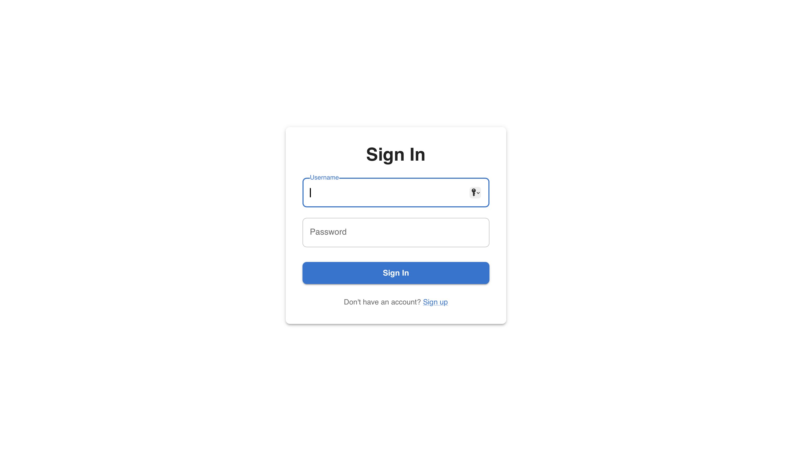
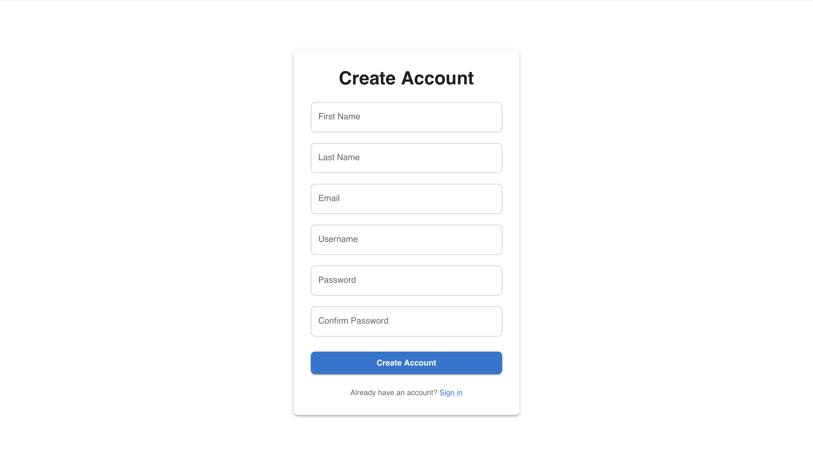
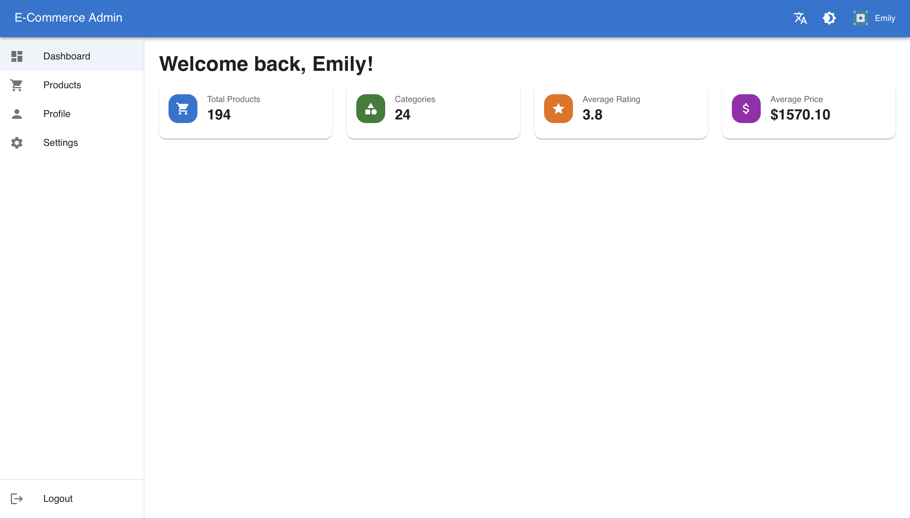
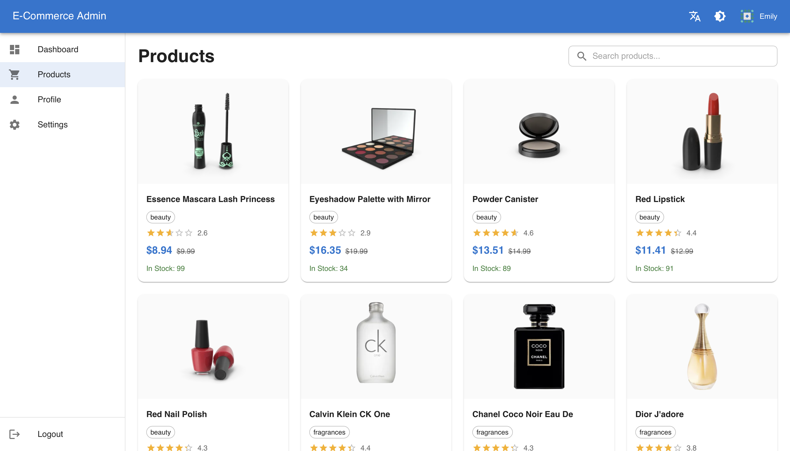
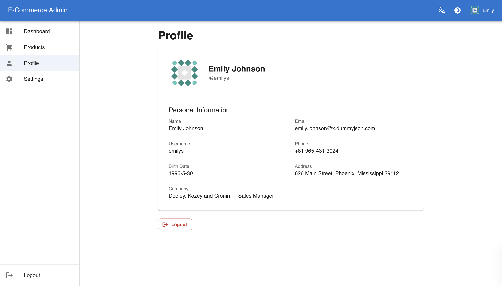
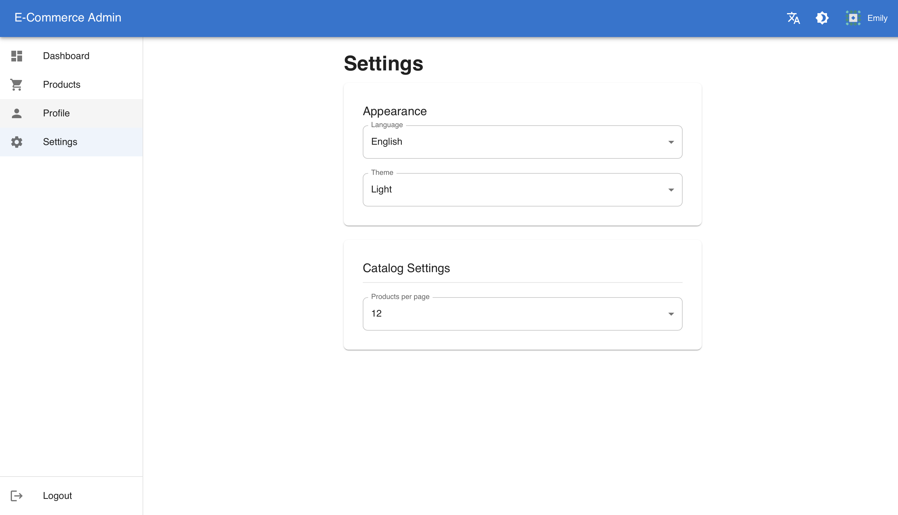
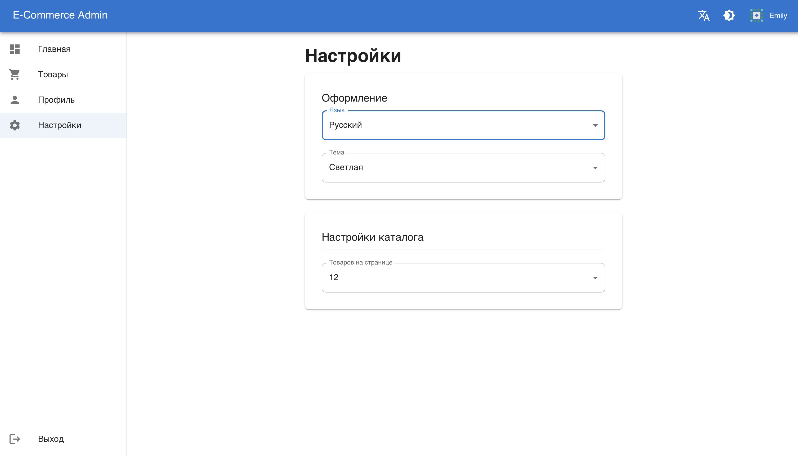

# E-Commerce Admin Panel (HW3)

SPA административная панель для e-commerce системы, реализованная с использованием React + TypeScript.

## Запуск

```bash
npm install
npm run dev
```

Приложение будет доступно по адресу: http://localhost:3000

### Сборка для продакшена

```bash
npm run build
npm run preview
```

## Тестовые данные для входа

Используется [DummyJSON API](https://dummyjson.com/docs). Для входа можно использовать:

- **Username:** `emilys`
- **Password:** `emilyspass`

Полный список пользователей: https://dummyjson.com/users

## Стек технологий

- **React 19** + **TypeScript**
- **Redux Toolkit** + **RTK Query** — управление состоянием и запросы к API
- **React Router v7** — маршрутизация с lazy loading
- **MUI (Material UI) v6** — UI-компоненты
- **react-i18next** — интернационализация (ru / en)
- **Vite** — сборка проекта

## Архитектура (Feature Sliced Design)

Проект организован по методологии [Feature Sliced Design](https://feature-sliced.design/):

```
src/
├── app/                    # Инициализация приложения
│   ├── App.tsx             # Корневой компонент
│   ├── store.ts            # Redux store
│   ├── router.tsx          # Маршрутизация (lazy loading)
│   ├── guards/             # ProtectedRoute / PublicRoute
│   └── providers/          # ThemeProvider, AuthInitializer
│
├── pages/                  # Страницы (lazy loaded)
│   ├── login/              # Авторизация
│   ├── register/           # Регистрация (заглушка)
│   ├── dashboard/          # Главная панель
│   ├── products/           # Список продуктов
│   ├── product-detail/     # Детальная страница продукта
│   ├── profile/            # Профиль пользователя
│   ├── settings/           # Настройки
│   ├── logout/             # Выход из системы
│   └── not-found/          # 404
│
├── widgets/                # Составные UI-блоки
│   ├── header/             # Шапка с переключателями темы/языка
│   ├── sidebar/            # Навигационная панель
│   └── layout/             # Общий layout для приватных страниц
│
├── features/               # Функциональные модули
│   ├── auth/               # Авторизация (slice, API, LoginForm)
│   ├── settings/           # Настройки (slice: тема, язык, pageSize)
│   └── product-search/     # Поиск по продуктам
│
├── entities/               # Бизнес-сущности
│   ├── product/            # Продукт (типы, API, ProductCard)
│   └── user/               # Пользователь (типы)
│
└── shared/                 # Переиспользуемый код
    ├── api/                # Базовая конфигурация RTK Query
    ├── ui/                 # Spinner, ErrorMessage, EmptyState, ErrorBoundary
    ├── lib/                # Типизированные хуки (useAppDispatch, useAppSelector)
    └── i18n/               # Конфигурация i18n + переводы (en.json, ru.json)
```

### Правила импортов между слоями

Каждый слой может импортировать только из слоёв ниже:

```
app → pages → widgets → features → entities → shared
```

## Функциональность

### Аутентификация
- Логин через DummyJSON API (`POST /auth/login`)
- Хранение токена в localStorage + Redux
- Автоматическая инициализация сессии при перезагрузке (`GET /auth/me`)
- Protected / Public routes с редиректами
- Logout с очисткой состояния

### Каталог продуктов
- Список с пагинацией (limit/skip через query-параметры)
- Поиск по названию (`GET /products/search`)
- Детальная страница продукта с отзывами
- Кэширование данных через RTK Query
- Обработка loading / error / empty state

### Настройки
- Тема: светлая / тёмная (MUI ThemeProvider)
- Язык: русский / английский (react-i18next)
- Размер страницы каталога (6 / 12 / 24 / 48)
- Persist настроек в localStorage

### i18n
- Полный перевод всех страниц, форм, ошибок и пустых состояний
- Переключение без перезагрузки страницы
- JSON-файлы переводов (`shared/i18n/en.json`, `shared/i18n/ru.json`)

## Скриншоты

### Страница входа (Sign In)
Форма логина с валидацией полей.



### Регистрация
UI-заглушка страницы регистрации.



### Главная (Dashboard)
Статистика по товарам: общее количество, категории, средний рейтинг и цена.



### Каталог товаров
Карточки продуктов с поиском и пагинацией. Отображение цены, рейтинга, категории.



### Профиль
Данные авторизованного пользователя с возможностью выхода.



### Настройки
Выбор языка, темы оформления и количества товаров на странице.



### Локализация (ru / en)
Переключение языка интерфейса без перезагрузки.


